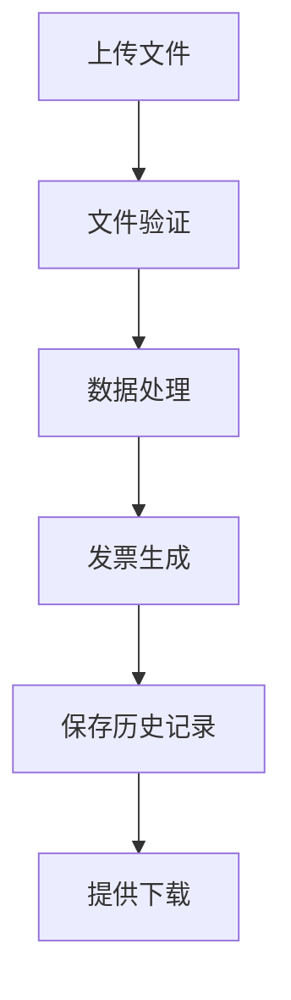

# 应用流程文档

## 1. 概述
该应用是一个基于Flask的Web票据处理系统，主要用于处理装箱单和生成发票。系统支持文件上传、数据处理、发票生成和历史记录管理等功能。

## 2. 主要功能
- **文件上传处理**: 支持上传Excel格式的装箱单文件
- **发票生成**: 根据不同模板（如叮铛卡航限时达）生成对应格式的发票
- **数据处理**: 处理装箱单信息，包括商品信息、箱子信息等
- **历史记录管理**: 保存处理记录，支持90天的历史记录查询
- **文件下载**: 支持下载生成的发票文件

## 3. 流程图

## 4. 用户交互
1. **文件上传**：用户通过Web界面上传Excel格式的装箱单
2. **处理状态**：系统显示实时处理状态和进度
3. **结果获取**：处理完成后，用户可以下载生成的发票文件
4. **历史记录**：用户可以查看和下载历史处理记录
